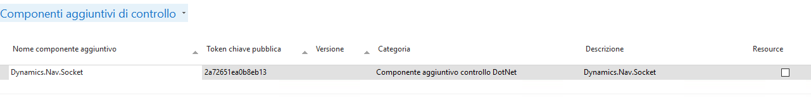

## Dynamics.Nav.Socket
Easy example of how to create and handle a socket server on Microsoft Dynamics NAV.

In the example a control add in generate a thread which runs a socket server that will receive data from clients.
Whenever a client send something it will run a trigger on the page that allow to run code (for example for save the received data or show it in page and so on...)

Just need to register the add in on the service:

